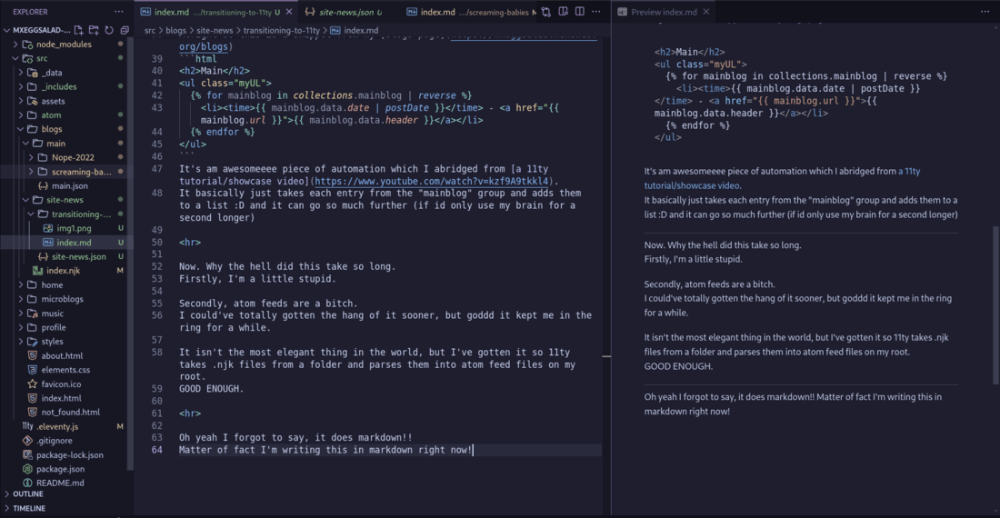

HOLYFUCK AHHHHH

it's  

ITS DONE

 

Shite guys,  
Its taken me a while but I've finally finished learning this admitedly cool engine.

Goddd did it take a while though

Alright for the uninitiated, [11ty](https://11ty.dev) is a pretty nice site generator which perked my ears a while ago because of how *annoyingggg* working with large ass html files is.

~~(then i lost all motivation for my site for like 1-2 months...)~~

But eventually I found that gosh it has a myriad of other features that can help me so so much.

Mainly, its features relating to automated layours help me the most I'd say

I can just chuck all of my boilerplate or more complex layouts into completely separate files!!! Lifesaver seriously

Even though this was the initiating factor for me, another big feature keeping me here is the automation  
omg the automation

Alright so this is a snippet from my [blogs page](https://mxeggsalad.nekoweb.org/blogs) 

It's am awesomeeee piece of automation which I abridged from [a 11ty tutorial/showcase video](https://www.youtube.com/watch?v=kzf9A9tkkl4).  
It basically just takes each entry from the "mainblog" group and adds them to a list :D and it can go so much further (if id only use my brain for a second longer)

Now. Why the hell did this take so long.  
Firstly, I'm a little stupid.

Secondly, atom feeds are a bitch.  
I could've totally gotten the hang of it sooner, but goddd it kept me in the ring for a while.

It isn't the most elegant thing in the world, but I've gotten it so 11ty takes .njk files from a folder and parses them into atom feed files on my root.   
GOOD ENOUGH.

(sadly this means i need to nuke and ruin my older rss feeds, sorry if anyone was actually using them)

(oh also, im way too lazy to actually add image support to the feeds, so give me a moment to work that out)

Oh yeah I forgot to say, it does markdown!!  
Matter of fact I'm writing this in markdown right now!

God this is such a novel thing for me.

11ty actually converts a lot of other files into html files, as I mentioned before njk -> xml, but you can find that on their own website.

All of this to say, I'M BACK!  
And pretty much, as motivated as I'll ever be!
